# LPML-Enhanced LLM Decision Analysis

*Generated on: 2025-05-22 04:13:47*

## Game Summary

- **Opponent**: BabyPlayer
- **Result**: LPML-enhanced LLM wins
- **Total Moves**: 9

## Complete Game Visualization

### Initial Board State

```
+-------------+
|             |
|             |
|             |
|             |
|             |
|             |
|0 1 2 3 4 5 6|
+-------------+
```

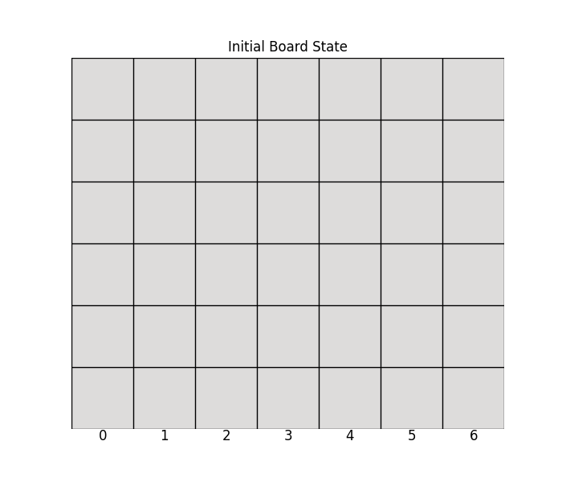

### Turn 1: LPML-LLM (Column 3)

```
+-------------+
|             |
|             |
|             |
|             |
|      O      |
|      X      |
|0 1 2 3 4 5 6|
+-------------+
```

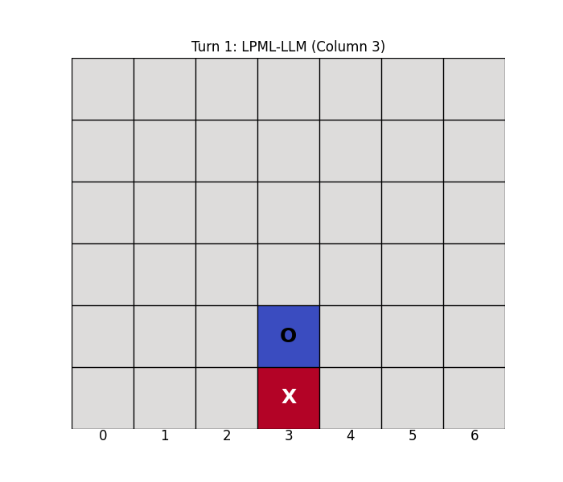

### Turn 2: BabyPlayer

```
+-------------+
|             |
|             |
|             |
|             |
|      O      |
|      X      |
|0 1 2 3 4 5 6|
+-------------+
```

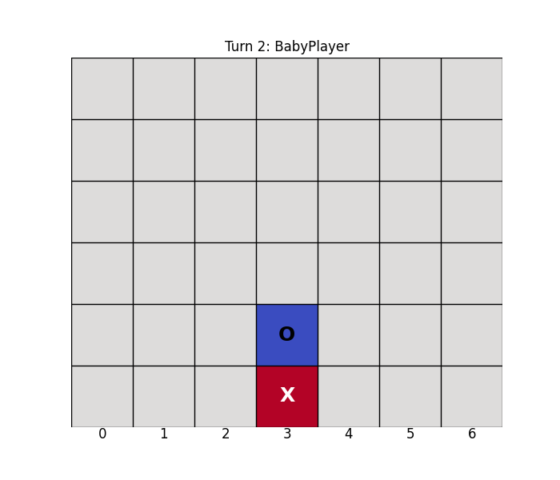

### Turn 3: LPML-LLM (Column 4)

```
+-------------+
|             |
|             |
|             |
|             |
|      O O    |
|      X X    |
|0 1 2 3 4 5 6|
+-------------+
```

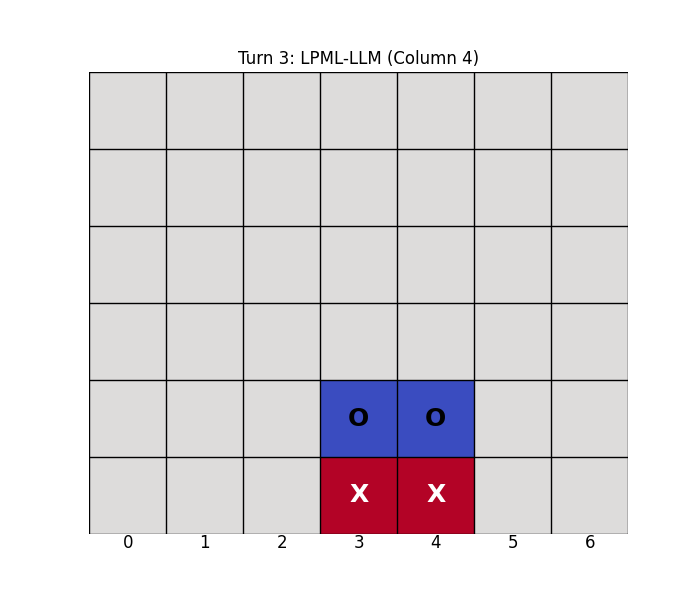

### Turn 4: BabyPlayer

```
+-------------+
|             |
|             |
|             |
|             |
|      O O    |
|      X X    |
|0 1 2 3 4 5 6|
+-------------+
```


### Turn 5: LPML-LLM (Column 5)

```
+-------------+
|             |
|             |
|             |
|             |
|      O O    |
|      X X X O|
|0 1 2 3 4 5 6|
+-------------+
```

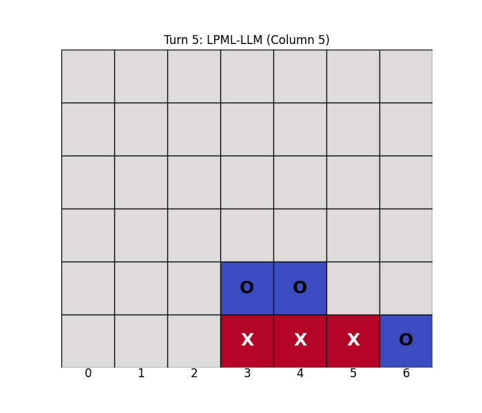

### Turn 6: BabyPlayer

```
+-------------+
|             |
|             |
|             |
|             |
|      O O    |
|      X X X O|
|0 1 2 3 4 5 6|
+-------------+
```

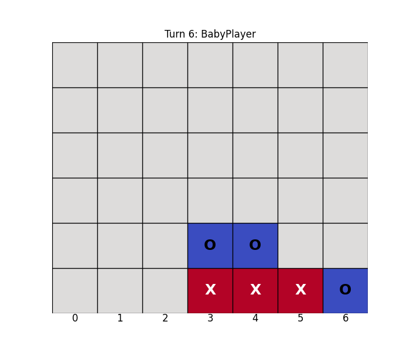

### Turn 7: LPML-LLM (Column 6)

```
+-------------+
|             |
|             |
|             |
|             |
|      O O   X|
|    O X X X O|
|0 1 2 3 4 5 6|
+-------------+
```

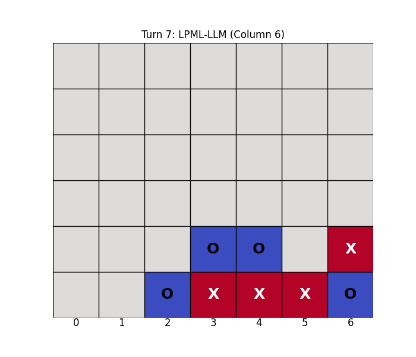

### Turn 8: BabyPlayer

```
+-------------+
|             |
|             |
|             |
|             |
|      O O   X|
|    O X X X O|
|0 1 2 3 4 5 6|
+-------------+
```


### Turn 9: LPML-LLM (Column 6)

```
+-------------+
|             |
|             |
|             |
|        O   X|
|      O O   X|
|    O X X X O|
|0 1 2 3 4 5 6|
+-------------+
```

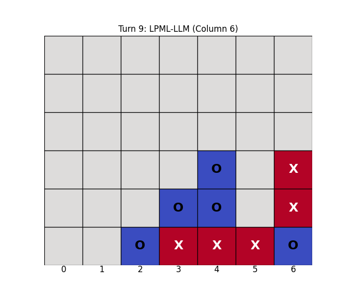

### Turn 10: BabyPlayer

```
+-------------+
|             |
|             |
|             |
|        O   X|
|      O O   X|
|    O X X X O|
|0 1 2 3 4 5 6|
+-------------+
```


### Turn 11: LPML-LLM (Column 3)

```
+-------------+
|             |
|             |
|        O    |
|      X O   X|
|      O O   X|
|    O X X X O|
|0 1 2 3 4 5 6|
+-------------+
```


### Turn 12: BabyPlayer

```
+-------------+
|             |
|             |
|        O    |
|      X O   X|
|      O O   X|
|    O X X X O|
|0 1 2 3 4 5 6|
+-------------+
```

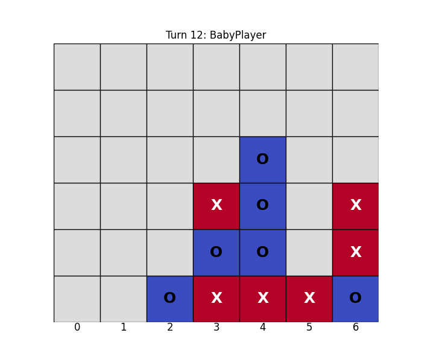

### Turn 13: LPML-LLM (Column 3)

```
+-------------+
|             |
|             |
|      X O   O|
|      X O   X|
|      O O   X|
|    O X X X O|
|0 1 2 3 4 5 6|
+-------------+
```


### Turn 14: BabyPlayer

```
+-------------+
|             |
|             |
|      X O   O|
|      X O   X|
|      O O   X|
|    O X X X O|
|0 1 2 3 4 5 6|
+-------------+
```

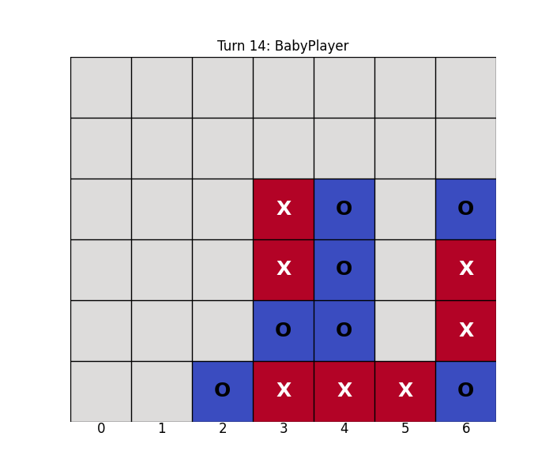

### Turn 15: LPML-LLM (Column 3)

```
+-------------+
|             |
|      X      |
|      X O   O|
|      X O   X|
|      O O   X|
|  O O X X X O|
|0 1 2 3 4 5 6|
+-------------+
```

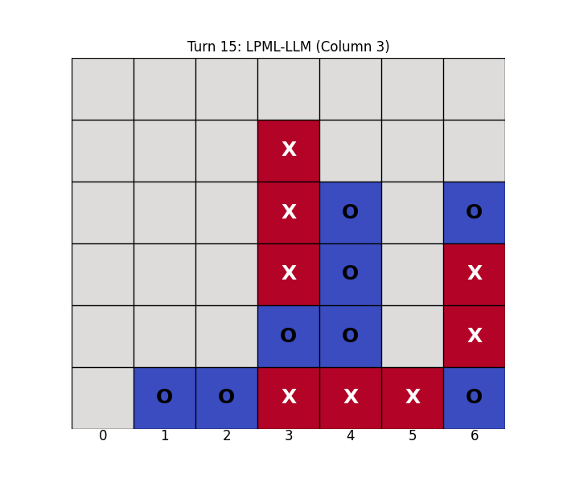

### Turn 16: BabyPlayer

```
+-------------+
|             |
|      X      |
|      X O   O|
|      X O   X|
|      O O   X|
|  O O X X X O|
|0 1 2 3 4 5 6|
+-------------+
```

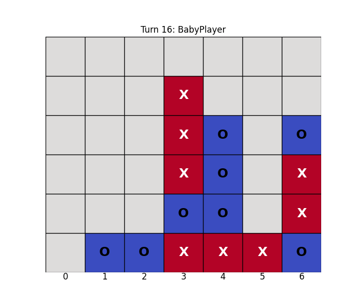

### Turn 17: LPML-LLM (Column 3)

```
+-------------+
|      O      |
|      O      |
|      O X   X|
|      O X   O|
|      X X   O|
|  X X O O O X|
|0 1 2 3 4 5 6|
+-------------+
```

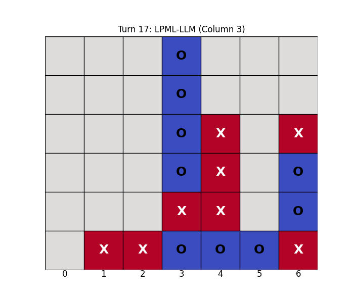

## LLM Decision Analysis

### Move 1: Column 3

#### Board State Before Decision


#### Retrieved Strategic Knowledge

**Reference 1 (Similarity: -3.12%):**

```
Board state: Board state at turn 5
Strategic analysis: Strategic analysis for move to column 0
Move execution: Place piece in column 0
Action: 0
```

**Reference 2 (Similarity: -5.48%):**

```
Board state: Board state at turn 4
Strategic analysis: Strategic analysis for move to column 0
Move execution: Place piece in column 0
Action: 0
```

**Reference 3 (Similarity: -6.63%):**

```
Board state: Board state at turn 2
Strategic analysis: Strategic analysis for move to column 0
Move execution: Place piece in column 0
Action: 0
```

#### LLM Analysis

The current board state is completely empty, which means there are no immediate threats from the opponent and no pieces on the board. As 'X', I have the opportunity to place my piece in any column without any risk of being blocked or countered. The center columns (3 and 4) are generally more advantageous in Connect Four because they provide more opportunities for connecting pieces both horizontally and diagonally. 

#### Consideration of References

The references consistently suggest placing a piece in column 0, but they all come from earlier turns with different board states. Since the current board is empty, I believe that my own analysis should take precedence over the references. The references do not account for the strategic advantages of occupying the center columns early in the game. 

#### Decision Process

Given the empty board, I will place my piece in column 3. This column is centrally located, allowing for maximum flexibility in future moves to connect four pieces either horizontally, vertically, or diagonally. 

---

### Move 2: Column 4

#### Board State Before Decision


#### Retrieved Strategic Knowledge

**Reference 1 (Similarity: -0.38%):**

```
Board state: Board state at turn 5
Strategic analysis: Strategic analysis for move to column 0
Move execution: Place piece in column 0
Action: 0
```

**Reference 2 (Similarity: -2.51%):**

```
Board state: Board state at turn 4
Strategic analysis: Strategic analysis for move to column 0
Move execution: Place piece in column 0
Action: 0
```

**Reference 3 (Similarity: -3.72%):**

```
Board state: Board state at turn 2
Strategic analysis: Strategic analysis for move to column 0
Move execution: Place piece in column 0
Action: 0
```

#### LLM Analysis

In the current board state, I am playing as 'X' and looking to connect four pieces. The board shows that I have one piece in column 3, and my opponent 'O' has one piece in column 3 as well. There are no immediate threats from 'O' to win in the next turn, but I need to consider how to build my own connections while blocking potential threats. Columns 0, 1, 2, 4, 5, and 6 are all empty in the lowest row, which means I can place my piece in any of those columns.  Considering the current board, placing my piece in column 4 would be strategic as it allows me to build towards a potential vertical or diagonal connection while also blocking the center column where 'O' has placed their piece. This move would create opportunities for me to connect horizontally or diagonally in future turns. 

#### Consideration of References

The references suggest a consistent strategy of placing pieces in column 0, but the current board state does not indicate that column 0 is the best option for me. Instead, I need to focus on central control and potential connections, which is why I am leaning towards column 4 instead of following the references blindly. 

#### Decision Process

I believe that placing my piece in column 4 will provide me with the best chance to create a winning strategy while also blocking my opponent's potential moves in the center. 

---

### Move 3: Column 5

#### Board State Before Decision


#### Retrieved Strategic Knowledge

**Reference 1 (Similarity: 0.51%):**

```
Board state: Board state at turn 5
Strategic analysis: Strategic analysis for move to column 0
Move execution: Place piece in column 0
Action: 0
```

**Reference 2 (Similarity: -1.63%):**

```
Board state: Board state at turn 4
Strategic analysis: Strategic analysis for move to column 0
Move execution: Place piece in column 0
Action: 0
```

**Reference 3 (Similarity: -2.86%):**

```
Board state: Board state at turn 2
Strategic analysis: Strategic analysis for move to column 0
Move execution: Place piece in column 0
Action: 0
```

#### LLM Analysis

In the current board state, I see that I have two 'X' pieces in columns 3 and 4 on the bottom row. My immediate goal is to either create a winning opportunity or block my opponent from winning. The opponent has two 'O' pieces in columns 4 and 5 on the same row. If I do not block column 5, the opponent can win on their next turn by placing an 'O' there. Therefore, I need to prioritize blocking that column while also considering my own potential to connect four. 

#### Consideration of References

The references provided suggest a consistent focus on column 0, but they do not seem relevant to the current board state where immediate threats and opportunities exist in columns 4 and 5. My analysis diverges from the references as they do not address the pressing need to block the opponent's potential win. 

#### Decision Process

Given the current board state, the best move is to place my 'X' in column 5. This blocks the opponent from winning on their next turn and also keeps my options open for future moves. 

---

### Move 4: Column 6

#### Board State Before Decision


#### Retrieved Strategic Knowledge

**Reference 1 (Similarity: 0.52%):**

```
Board state: Board state at turn 5
Strategic analysis: Strategic analysis for move to column 0
Move execution: Place piece in column 0
Action: 0
```

**Reference 2 (Similarity: -2.00%):**

```
Board state: Board state at turn 4
Strategic analysis: Strategic analysis for move to column 0
Move execution: Place piece in column 0
Action: 0
```

**Reference 3 (Similarity: -3.13%):**

```
Board state: Board state at turn 2
Strategic analysis: Strategic analysis for move to column 0
Move execution: Place piece in column 0
Action: 0
```

#### LLM Analysis

In the current board state, I am playing as 'X' and I have three pieces in a row in column 3, 4, and 5. If I place my piece in column 6, I will not only block my opponent from potentially winning in their next turn (if they place in column 6), but I will also create an opportunity for myself to connect four pieces in the next turn by placing in column 3, which would give me four in a row horizontally (3, 4, 5, 6). 

#### Consideration of References

The references indicate a consistent strategy of placing pieces in column 0, but they do not apply to this specific board state. My analysis shows that column 6 is a more strategic choice given the current positioning of pieces and the immediate threat from my opponent. 

#### Decision Process

I will place my piece in column 6 to block my opponent and set myself up for a potential win in the next turn. 

---

### Move 5: Column 6

#### Board State Before Decision


#### Retrieved Strategic Knowledge

**Reference 1 (Similarity: 1.81%):**

```
Board state: Board state at turn 5
Strategic analysis: Strategic analysis for move to column 0
Move execution: Place piece in column 0
Action: 0
```

**Reference 2 (Similarity: -0.67%):**

```
Board state: Board state at turn 4
Strategic analysis: Strategic analysis for move to column 0
Move execution: Place piece in column 0
Action: 0
```

**Reference 3 (Similarity: -1.61%):**

```
Board state: Board state at turn 2
Strategic analysis: Strategic analysis for move to column 0
Move execution: Place piece in column 0
Action: 0
```

#### LLM Analysis

In the current board state, I see that I have three 'X' pieces in a row in columns 3, 4, and 5 on the bottom row. If I place my piece in column 6, I will create a horizontal line of four 'X' pieces (3, 4, 5, and 6). This would immediately win the game for me. Additionally, placing a piece in any other column (0, 1, or 2) does not provide an immediate winning opportunity and could potentially allow my opponent 'O' to block or create their own winning move. 

#### Consideration of References

The references provided all suggest placing a piece in column 0, but they do not align with the current board state where I have an immediate winning opportunity. While they offer some strategic insight, they are not applicable to this specific situation where I can win outright. 

#### Decision Process

Given the opportunity to win by placing my piece in column 6, this is the best move. It not only secures my victory but also prevents any chance for my opponent to counteract in this turn. 

---

### Move 6: Column 3

#### Board State Before Decision


#### Retrieved Strategic Knowledge

**Reference 1 (Similarity: 2.36%):**

```
Board state: Board state at turn 5
Strategic analysis: Strategic analysis for move to column 0
Move execution: Place piece in column 0
Action: 0
```

**Reference 2 (Similarity: -0.01%):**

```
Board state: Board state at turn 4
Strategic analysis: Strategic analysis for move to column 0
Move execution: Place piece in column 0
Action: 0
```

**Reference 3 (Similarity: -0.96%):**

```
Board state: Board state at turn 2
Strategic analysis: Strategic analysis for move to column 0
Move execution: Place piece in column 0
Action: 0
```

#### LLM Analysis

In the current board state, I am playing as 'X' and need to assess the potential moves. The board shows that 'O' has two pieces in column 3 and two in column 4, which means they are close to forming a vertical connection. My immediate goal is to prevent 'O' from winning while also creating opportunities for myself. The best move would be to place an 'X' in column 3, which would block 'O' from winning on their next turn and also set me up for a potential win in the future. 

#### Consideration of References

The references all suggest placing a piece in column 0, but they are not relevant to the current board state since they do not address the immediate threat posed by 'O'. My analysis indicates that column 3 is critical to prevent 'O' from winning. 

#### Decision Process

I will place my piece in column 3 to block 'O' and protect my chances of winning. 

---

### Move 7: Column 3

#### Board State Before Decision


#### Retrieved Strategic Knowledge

**Reference 1 (Similarity: 2.72%):**

```
Board state: Board state at turn 5
Strategic analysis: Strategic analysis for move to column 0
Move execution: Place piece in column 0
Action: 0
```

**Reference 2 (Similarity: 0.37%):**

```
Board state: Board state at turn 4
Strategic analysis: Strategic analysis for move to column 0
Move execution: Place piece in column 0
Action: 0
```

**Reference 3 (Similarity: -0.60%):**

```
Board state: Board state at turn 2
Strategic analysis: Strategic analysis for move to column 0
Move execution: Place piece in column 0
Action: 0
```

#### LLM Analysis

In the current board state, I am playing as 'X' and I need to evaluate the potential moves. The board shows that there are two 'O' pieces in column 3, which is a potential threat since the opponent could win on their next turn if they place another 'O' in that column. Additionally, I have a strong presence in columns 2, 3, 4, and 5, with a potential to connect four horizontally or vertically. The most immediate threat is in column 3, where I need to block the opponent from winning. Therefore, placing my piece in column 3 is critical to prevent an immediate loss. 

#### Consideration of References

The references provided all suggest placing a piece in column 0, but they do not seem relevant to the current board state, as they are from earlier turns with different configurations. My analysis indicates that the focus should be on blocking the opponent rather than following the previous strategies blindly. 

#### Decision Process

Given the immediate threat of the opponent winning by placing an 'O' in column 3, my best move is to place my 'X' in that column to block them. This move not only prevents a loss but also maintains my position to potentially connect four in future turns. 

---

### Move 8: Column 3

#### Board State Before Decision


#### Retrieved Strategic Knowledge

**Reference 1 (Similarity: 3.23%):**

```
Board state: Board state at turn 5
Strategic analysis: Strategic analysis for move to column 0
Move execution: Place piece in column 0
Action: 0
```

**Reference 2 (Similarity: 0.83%):**

```
Board state: Board state at turn 4
Strategic analysis: Strategic analysis for move to column 0
Move execution: Place piece in column 0
Action: 0
```

**Reference 3 (Similarity: -0.09%):**

```
Board state: Board state at turn 2
Strategic analysis: Strategic analysis for move to column 0
Move execution: Place piece in column 0
Action: 0
```

#### LLM Analysis

In the current board state, I am playing as 'X' and I need to analyze potential moves to either create a winning opportunity or block my opponent 'O'. The board shows that 'O' has three pieces in a row in column 3, which means they are one move away from winning if I do not block them. Therefore, my immediate priority is to place my piece in column 3 to prevent 'O' from winning on their next turn. 

#### Consideration of References

The references provided all suggest placing a piece in column 0, but they do not apply to the current situation. The board state is different, and the immediate threat from 'O' in column 3 takes precedence over any previous strategies that might have suggested column 0. 

#### Decision Process

Given the urgency of blocking 'O' from winning, my best move is to place my piece in column 3. This not only prevents 'O' from winning but also keeps my own chances alive for future moves. 

---

### Move 9: Column 3

#### Board State Before Decision


#### Retrieved Strategic Knowledge

**Reference 1 (Similarity: 3.54%):**

```
Board state: Board state at turn 5
Strategic analysis: Strategic analysis for move to column 0
Move execution: Place piece in column 0
Action: 0
```

**Reference 2 (Similarity: 1.11%):**

```
Board state: Board state at turn 4
Strategic analysis: Strategic analysis for move to column 0
Move execution: Place piece in column 0
Action: 0
```

**Reference 3 (Similarity: 0.23%):**

```
Board state: Board state at turn 2
Strategic analysis: Strategic analysis for move to column 0
Move execution: Place piece in column 0
Action: 0
```

#### LLM Analysis

In the current board state, I am playing as 'X' and I see that I have three 'X' pieces stacked vertically in column 3. If I place another 'X' in column 3, I will connect four vertically and win the game. The other columns do not present an immediate winning opportunity for me, and I also need to be cautious of my opponent 'O' potentially creating a winning move in the next turn. However, the immediate priority is to secure my own win. 

#### Consideration of References

The references all suggest placing a piece in column 0, but they are based on different board states and do not apply to the current situation where I have a direct winning move available. The references do not provide relevant strategic insight for this specific board state since they do not address the winning opportunity in column 3. 

#### Decision Process

Given the current board state and the opportunity to win by placing my piece in column 3, this is the most logical and strategic move. It not only secures my victory but also prevents any chance for my opponent to block it. 

---

## Conclusion

### Effectiveness of LPML Guidance

- **Moves with LPML guidance**: 9 (100.0%)
- **Moves without LPML guidance**: 0 (0.0%)

The LPML-enhanced LLM had strategic knowledge available for most of its moves. This knowledge appears to have been beneficial, as the LPML-enhanced LLM won the game.

