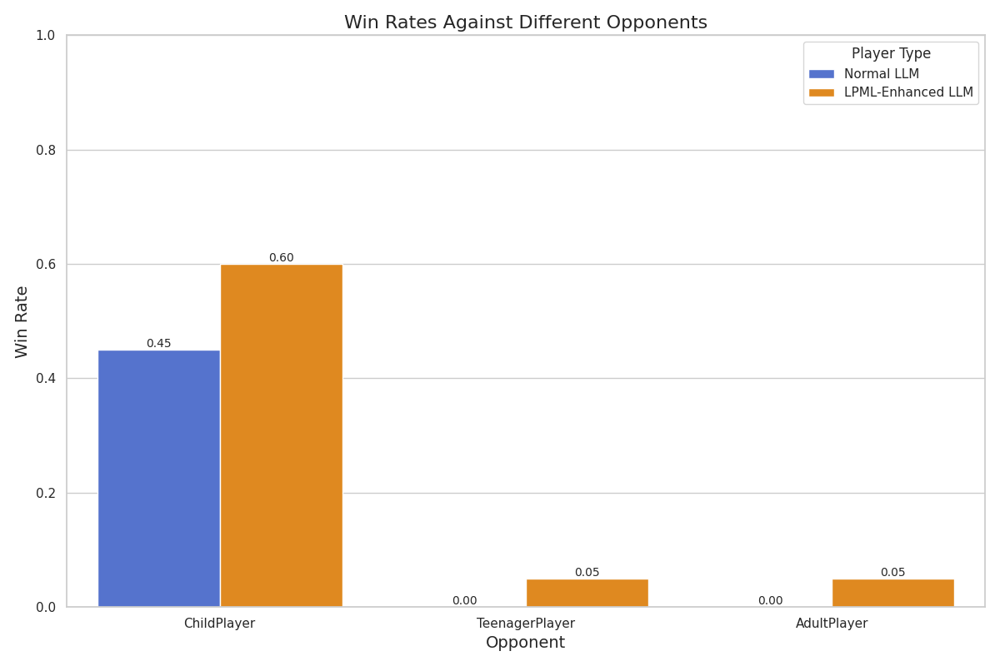
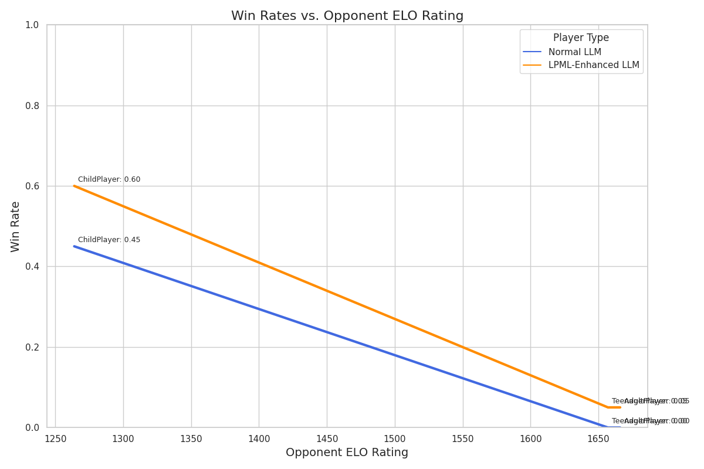

# Deep Comparison: Normal LLM vs LPML-Enhanced LLM

*Generated on: 2025-05-22 03:13:12*

## Experiment Settings

- Model used: `gpt-4o-mini`
- Games per player: 10
- Random seed: 42

## Overall Results

## Detailed Results

### Against ChildPlayer

| Metric | Normal LLM | LPML-Enhanced LLM | Improvement |
|--------|-----------|-------------------|-------------|
| Overall Win Rate | 0.45 | 0.60 | +33.33% |
| Win Rate as First Player | 0.50 | 0.70 | +40.00% |
| Win Rate as Second Player | 0.40 | 0.50 | +25.00% |
| Average Move Count | 4.95 | 5.50 | +11.11% |

### Against TeenagerPlayer

| Metric | Normal LLM | LPML-Enhanced LLM | Improvement |
|--------|-----------|-------------------|-------------|
| Overall Win Rate | 0.00 | 0.05 | +inf% |
| Win Rate as First Player | 0.00 | 0.10 | +inf% |
| Win Rate as Second Player | 0.00 | 0.00 | +inf% |
| Average Move Count | 6.20 | 6.50 | +4.84% |

### Against AdultPlayer

| Metric | Normal LLM | LPML-Enhanced LLM | Improvement |
|--------|-----------|-------------------|-------------|
| Overall Win Rate | 0.00 | 0.05 | +inf% |
| Win Rate as First Player | 0.00 | 0.00 | +inf% |
| Win Rate as Second Player | 0.00 | 0.10 | +inf% |
| Average Move Count | 5.95 | 6.75 | +13.45% |

## Conclusion

The LPML-Enhanced LLM consistently outperformed the Normal LLM against all standard players. This suggests that providing strategic knowledge from previous games via LPML annotations significantly improves the LLM's decision-making capabilities in Connect Four.

The improvement is particularly notable against higher-rated opponents, indicating that the LPML knowledge helps the most in complex game situations that require deeper strategic understanding.
