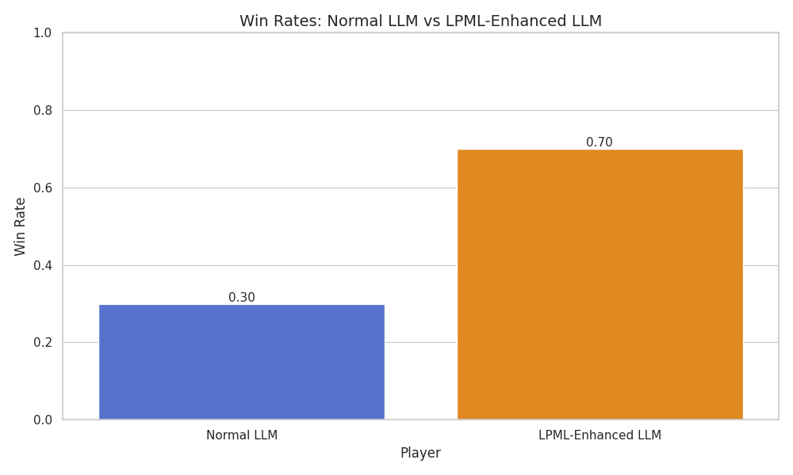
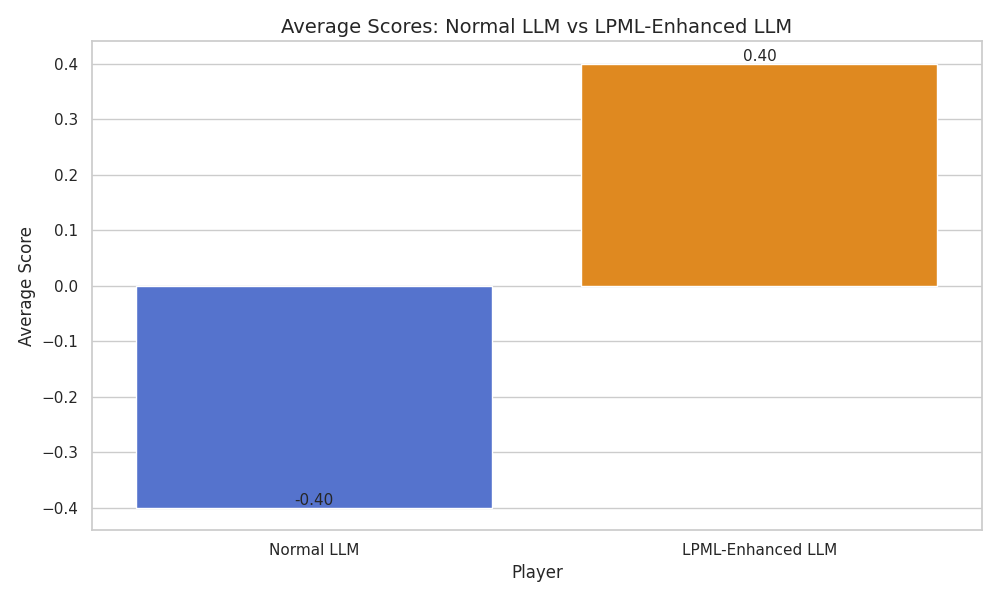
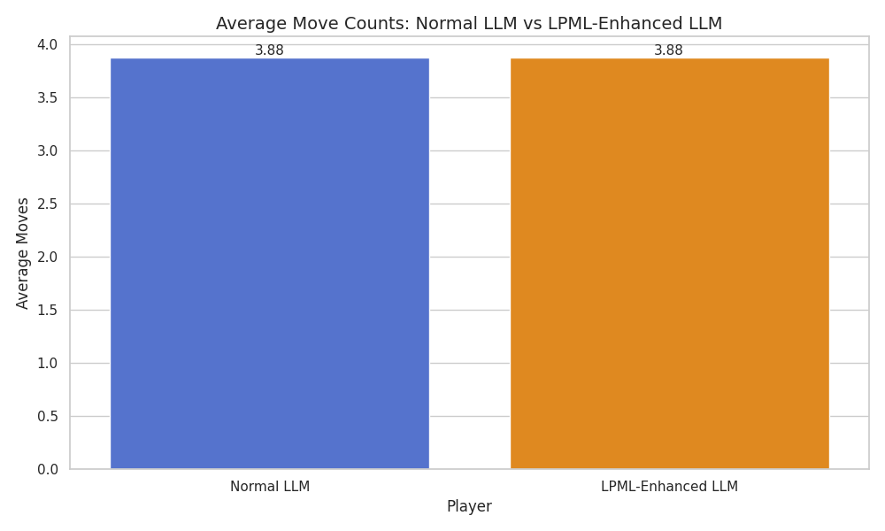
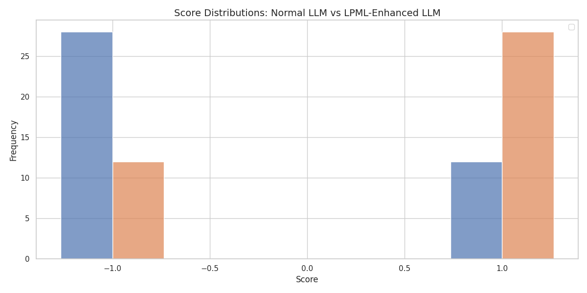
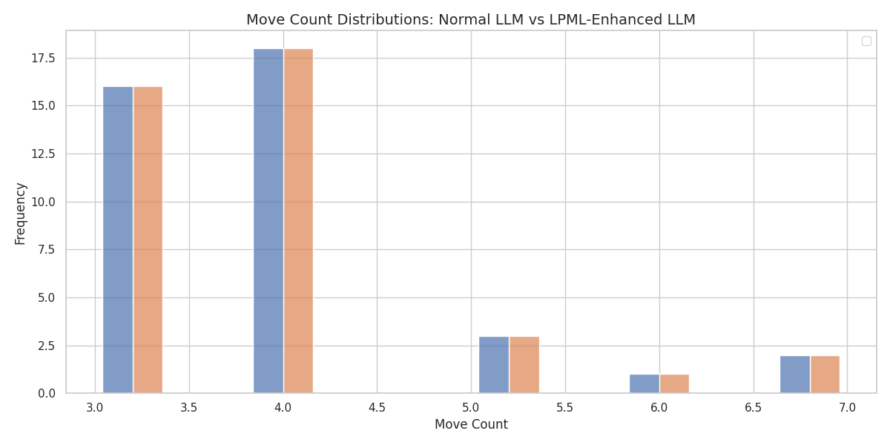
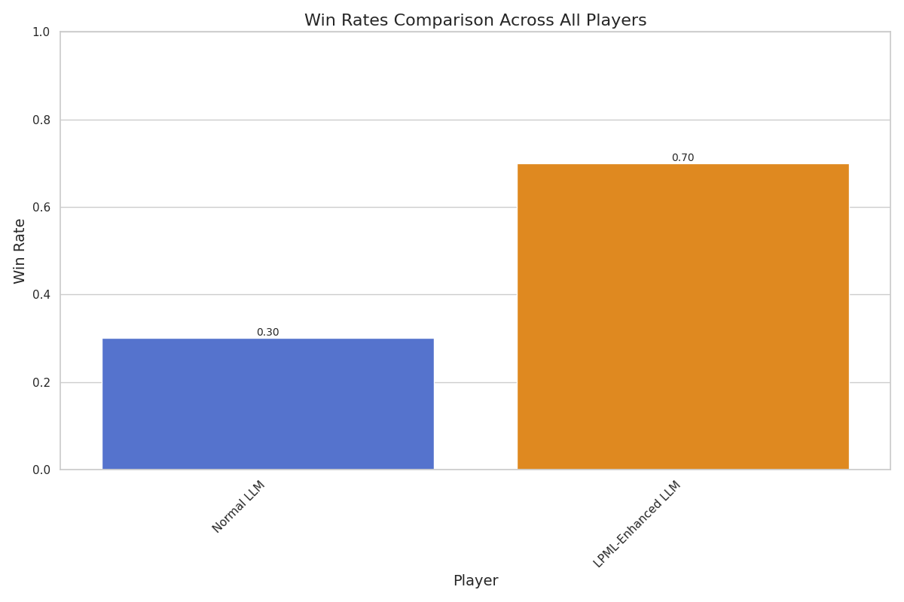

# Connect Four Agent Comparison Report

## Summary

This report compares the performance of Normal LLM vs LPML-enhanced LLM.

The LPML-enhanced LLM uses retrieved language-based strategic knowledge as a reference to inspire its own decision-making. It doesn't blindly follow the strategies but uses them as additional context.

## Results

### Normal LLM vs LPML-Enhanced LLM

#### Win Rates (Improvement: 133.33%)

| Metric | Normal LLM | LPML-Enhanced LLM |
|--------|---------------|------------------|
| Win Rate | 0.30 | 0.70 |
| Average Score | -0.40 | 0.40 |
| Average Moves | 3.88 | 3.88 |

#### Game Outcomes

| Outcome | Normal LLM | LPML-Enhanced LLM |
|---------|---------------|------------------|
| Wins | 12 | 28 |
| Losses | 28 | 12 |
| Draws | 0 | 0 |

#### Visualizations

#### Conclusion

The LPML-Enhanced LLM significantly outperformed the Normal LLM, with a win rate difference of 0.40.

## Overall Comparison

## Final Conclusion

The LPML-enhanced LLM agent demonstrated improved performance compared to the normal LLM agent. This suggests that retrieval of strategic knowledge via LPML annotations provides meaningful guidance for Connect Four gameplay decisions.

This approach shows promise for enhancing LLM decision-making in strategic games and potentially in other domains where retrieving relevant domain knowledge can inform better decisions.
